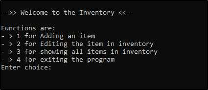
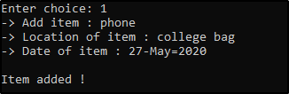
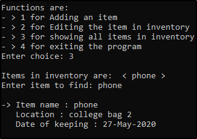
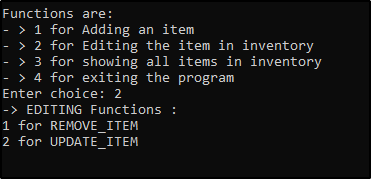

# Inventory
Inventory is a simple script that is used to keep track of items and their location. The entry fields include adding an item to inventory, showing all items in the inventory, editing an item and exit the app.

## Prerequisites

- **Python** must be installed. To install just [click here](https://www.python.org/downloads/release/python-382/).
- It uses os ,ast and time module of python.

## Installation and Usage

No installation is needed just git clone the directory and open the [inventory](inventory.py "script") file. This file can be made into an executable using pyinstaller by the following command.

> pyinstaller --noconfirm --onefile --nowindowed [inventory.py](inventory.py "script")

## Screenshots

## License

[MIT](https://choosealicense.com/licenses/mit/)

---
